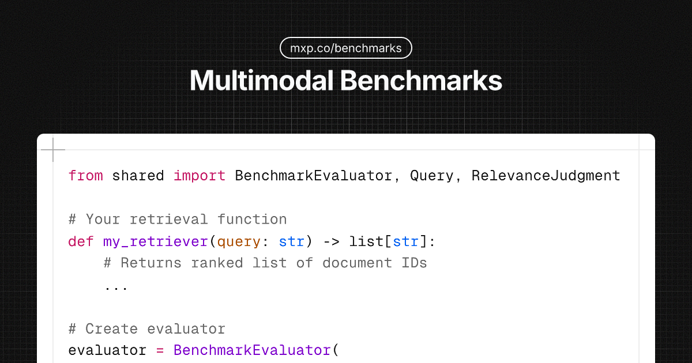

# Multimodal Benchmarks

The open evaluation suite for multimodal retrieval systems.

Standard datasets, queries, and relevance judgments for benchmarking retrieval across video, image, audio, and document modalities—particularly in regulated and high-stakes domains.

## 🎯 Quick Start

Choose your benchmark and get started in 60 seconds:

| Benchmark | Domain | Learn More | Leaderboard |
|-----------|--------|------------|-------------|
| **[Financial Documents](finance/)** | SEC filings, earnings reports | **[mxp.co/finance](https://mxp.co/finance)** | [View →](finance/LEADERBOARD.md) |
| **[Medical Devices](device/)** | IFUs, regulatory docs | **[mxp.co/device](https://mxp.co/device)** | [View →](device/LEADERBOARD.md) |
| **[Curriculum Search](learning/)** | Educational videos, lectures | **[mxp.co/learning](https://mxp.co/learning)** | [View →](learning/LEADERBOARD.md) |

### Run Any Benchmark

```bash
# Finance benchmark
cd finance && python run.py --quick

# Medical device benchmark
cd device && python run.py --quick

# Curriculum benchmark
cd learning && python run.py --quick
```

Each runs in ~1 second with demo data. See [QUICKSTART.md](QUICKSTART.md) for full guide.

## Why This Exists

Most retrieval benchmarks assume text-only search on clean web data. Real-world multimodal retrieval is harder:

- **Medical device IFUs** with nested tables, diagrams, and regulatory language
- **SEC filings** with embedded charts, footnotes, and cross-references
- **Educational videos** requiring temporal understanding and code-lecture alignment
- **Regulatory documents** spanning technical specs, clinical data, and safety reports

This repo provides ground-truth evaluation sets for these verticals—so you can measure what actually matters.

## 📊 Benchmarks Overview

All benchmarks are **available now** and include sample queries with human-annotated relevance judgments.

| Benchmark | Best NDCG@10 | Status | Documentation |
|-----------|--------------|--------|---------------|
| **[Finance](finance/)** | 0.78 | ✅ Available | [README](finance/README.md) · [Leaderboard](finance/LEADERBOARD.md) |
| **[Device](device/)** | 0.78 | ✅ Available | [README](device/README.md) · [Leaderboard](device/LEADERBOARD.md) |
| **[Learning](learning/)** | 0.84 | ✅ Available | [README](learning/README.md) · [Leaderboard](learning/LEADERBOARD.md) |

## 📁 Structure

```
benchmarks/
├── shared/                      # Shared utilities
│   ├── metrics.py              # Standard evaluation metrics
│   ├── evaluator.py            # Benchmark runner
│   └── __init__.py
│
├── finance/                     # Financial document benchmark
│   ├── run.py                  # Main benchmark script
│   ├── README.md               # Full documentation
│   ├── LEADERBOARD.md          # Results leaderboard
│   └── results/                # Benchmark results
│
├── device/                      # Medical device benchmark
│   ├── run.py
│   ├── README.md
│   ├── LEADERBOARD.md
│   └── results/
│
└── learning/                    # Curriculum search benchmark
    ├── run.py
    ├── README.md
    ├── LEADERBOARD.md
    └── results/
```

## 🚀 Quick Start

### 1. Install Dependencies

```bash
# Install shared dependencies
pip install numpy
```

### 2. Run a Benchmark

```bash
# Run with demo data (no setup required)
cd finance && python run.py --quick

# Run with your own data
cd finance && python run.py --data-dir /path/to/documents
```

### 3. Evaluate Your Retriever

All benchmarks use a standard interface:

```python
from shared import BenchmarkEvaluator, Query, RelevanceJudgment

# Your retrieval function
def my_retriever(query: str) -> list[str]:
    # Returns ranked list of document IDs
    ...

# Create evaluator
evaluator = BenchmarkEvaluator(
    name="my-system",
    retriever_fn=my_retriever,
    k_values=[5, 10, 20]
)

# Run benchmark
queries = [...]  # Load your queries
judgments = [...]  # Load ground truth
report = evaluator.run(queries, judgments)

# Print results
evaluator.print_summary(report)
evaluator.save_report(report, "results.json")
```

## 📏 Standard Metrics

All benchmarks use consistent evaluation metrics:

- **NDCG@k** - Ranking quality (primary metric)
- **Recall@k** - Coverage of relevant documents
- **MRR** - Position of first relevant result
- **Precision@k** - Accuracy at cutoff
- **MAP** - Mean Average Precision
- **Latency (p95)** - 95th percentile response time

Detailed metric definitions in [shared/metrics.py](shared/metrics.py)

## 🏆 Leaderboards

Each benchmark maintains its own leaderboard:

- **[Financial Documents →](finance/LEADERBOARD.md)** - Best: 0.78 NDCG@10
- **[Medical Devices →](device/LEADERBOARD.md)** - Best: 0.78 NDCG@10
- **[Curriculum Search →](learning/LEADERBOARD.md)** - Best: 0.84 NDCG@10

### Submit Your Results

Beat the baseline? Submit your results:

1. Run benchmark: `cd finance && python run.py`
2. Results in: `finance/results/benchmark_results.json`
3. Open PR with results + system description
4. Appear on the leaderboard!

See individual benchmark READMEs for detailed submission instructions.

## 📚 Documentation

- **[Quick Start Guide](QUICKSTART.md)** - Get started in 60 seconds
- **[Finance Benchmark](finance/README.md)** - SEC filings, financial docs
- **[Device Benchmark](device/README.md)** - Medical device IFUs, regulatory docs
- **[Learning Benchmark](learning/README.md)** - Educational videos, lectures

## Contributing a Benchmark

We welcome contributions from researchers and practitioners working on vertical-specific retrieval.

### Requirements

1. **Minimum 100 queries** with relevance judgments
2. **Clear licensing** for underlying data
3. **Reproducible baseline** using at least one open retriever
4. **Documentation** describing the domain and evaluation protocol

### Submission Process

1. Fork this repo
2. Add your benchmark under a new directory
3. Include all required files (see structure above)
4. Open a PR with benchmark description

See [CONTRIBUTING.md](CONTRIBUTING.md) for full guidelines.

## Citation

If you use these benchmarks in your research:

```bibtex
@misc{mixpeek-multimodal-benchmarks,
  title={Multimodal Benchmarks: Evaluation Suite for Vertical Retrieval Systems},
  author={Mixpeek},
  year={2025},
  url={https://github.com/mixpeek/multimodal-benchmarks}
}
```

## License

Benchmark code: MIT License

Datasets: Individual licensing per benchmark (see each benchmark's `LICENSE` file)

---

Built by [Mixpeek](https://mixpeek.com) — Multimodal AI infrastructure for regulated industries.
